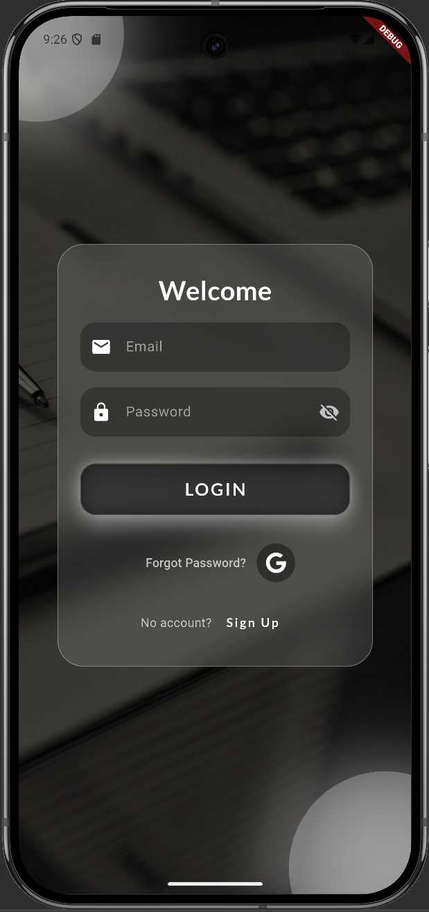
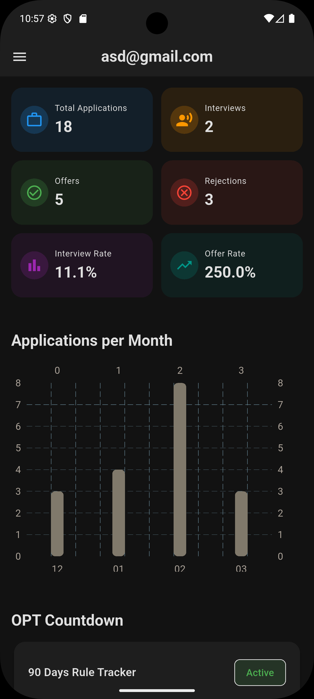
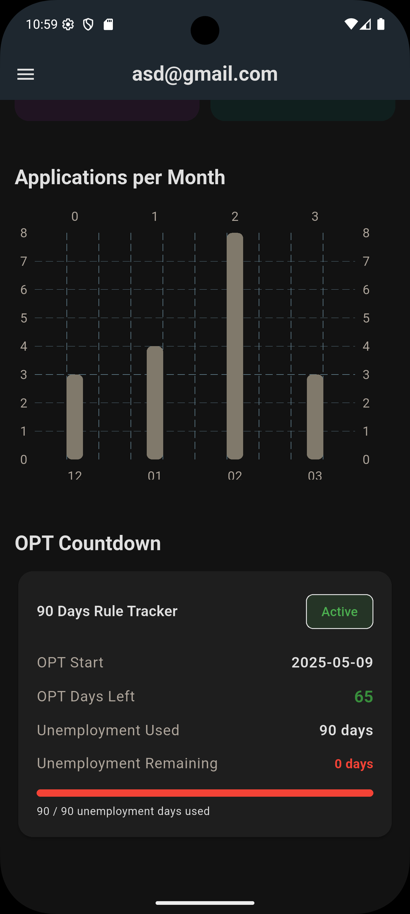
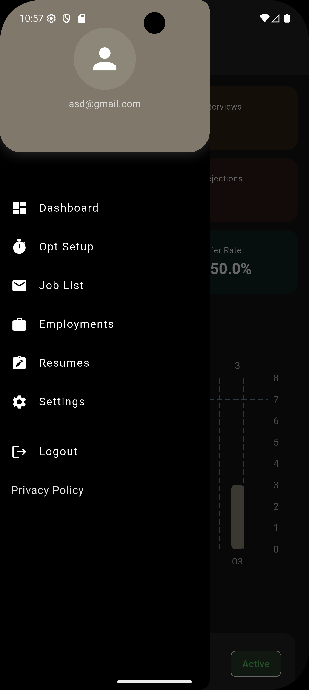

# OPTrak — Flutter + Firebase + Riverpod (Enterprise MVVM Architecture)

> **This project follows industry-standard MVVM architecture and demonstrates production-level Flutter engineering practices used in modern US tech companies.**

A scalable Flutter mobile application for international students in the U.S. to manage **job applications, employment history, and OPT timelines** while demonstrating modern mobile engineering practices.

This project is built to showcase **professional Flutter engineering skills for US recruiters and tech companies**.

---

# 📌 Overview

**OPTrak** is a modular Flutter application designed to help international students manage job applications and track OPT compliance while demonstrating modern mobile engineering practices.

The application includes:

- Job application tracking
- Employment history management
- OPT unemployment countdown logic
- Firebase authentication
- Scalable enterprise Flutter architecture

## 📱 App Screenshots

| Login | Dashboard |
|------|------|
|  |  |

| Dashboard Opt                   | Navigation Drawer |
|---------------------------------|------|
|  |  |

| Employment Tracker | Job Applications |
|------|------|


# ✨ Features

## 🔐 Authentication
- Firebase Email/Password Authentication
- Login, Sign Up, Forgot Password
- Auth Gate for persistent login session
- Splash Screen → Auth Gate → Dashboard flow
- Professional error handling:
    - Incorrect password
    - User not found
    - Invalid email
    - Weak password
    - Email already in use

---


## 🧠 Architecture & State Management
- **MVVM (Model–View–ViewModel)**
- **Riverpod for state management**
- Feature-first modular architecture
- Clean separation of UI, business logic, and services
- Centralized providers and services layer
- Scalable folder structure used in production apps

---

## 📊 Dashboard
- Job application statistics grid
- OPT countdown tracker (logic layer implemented)
- Future-ready Firestore analytics integration

---

## 🎨 UI & UX
- Light Mode
- Dark Mode
- System Theme Mode
- Material 3 UI
- Reusable global widgets
- Clean, maintainable UI code

---

## 📄 Resume Management

- Upload resume files (PDF, DOC, DOCX)
- File size validation
- Firebase Storage integration
- Secure file retrieval

---
## 🤖 AI Tools – Powered by Gemini

This project includes an AI module integrated into the Job Tracker app to help international students improve their job applications using Google's Gemini API.

The AI features are built using Flutter, MVVM architecture, Riverpod for state management, and Dio for networking.

## 🚀 Features

### 📄 Resume Analyzer
- Analyzes resume content
- Provides improvement suggestions
- Helps optimize for ATS systems

### 📑 Job Description Analyzer
- Extracts key skills from job descriptions
- Identifies missing skills in resume
- Helps match resume to job requirements

### ✉️ Cover Letter Generator
- Generates personalized cover letters
- Based on job title and company
- Saves time for job applications

### 🎯 Interview Questions Generator
- Generates role-based interview questions
- Helps users prepare for interviews
- Improves confidence

---

# 🏗️ Tech Stack

| Technology | Purpose |
|------------|----------|
| Flutter | Cross-platform mobile framework |
| Dart | Programming language |
| Firebase Authentication | User authentication |
| Cloud Firestore | Job tracking database |
| Riverpod | State management |
| MVVM Architecture | Scalable clean architecture |
| Material 3 | Modern UI design |

---

## 💼 Engineering Skills Demonstrated

- Scalable Flutter architecture (MVVM)
- Riverpod state management
- Firebase Authentication & Firestore integration
- Modular feature-based code organization
- Clean separation of UI, business logic, and services
- Production-level error handling


---


# ⚙️ Getting Started

## ✅ Prerequisites

- Flutter SDK (latest stable)
- Dart SDK
- Firebase project with Authentication & Firestore enabled

---

## 📥 Installation

### 1️⃣ Clone Repository

```bash
git clone https://github.com/syedmunib616/job-tracker.git
cd job-tracker
```
---
## 🧩 Architecture Overview

The application follows a clean MVVM architecture with Riverpod for state management.

UI (Views)
↓
ViewModels (State + Business Logic)
↓
Services (Firebase / API Layer)
↓
Firebase (Authentication, Firestore, Storage)

---
# 📂 Project Architecture (Enterprise MVVM + Feature-Based)

```text
lib/
├── core/                              # App-wide shared & global logic
│   ├── errors/                         # auth_failure.dart
│   ├── providers/                      # auth_providers.dart, theme_providers.dart
│   ├── constants/                      # app_colors.dart, app_strings.dart
│   ├── services/                       # Firebase & backend wrappers
│   │   ├── auth_service.dart
│   │   ├── employment_service.dart
│   │   ├── firestore_service.dart
│   │   ├── job_service.dart
│   │   ├── storage_service.dart
│   │   ├── notification_service.dart
│   │   └── opt_service.dart
│   │
│   ├── theme/                          # app_theme.dart
│   └── widgets/                        # Global reusable widgets
│       ├── app_loader.dart
│       ├── app_text_field.dart
│       ├── button.dart
│       └── drawer.dart
│
├── features/                           # Feature-based modular architecture
│   │
│   ├── ai_tools/
│   │      ├── views/
│   │      │    ├── resume_analyzer_view.dart
│   │      │    ├── job_description_analyzer_view.dart
│   │      │    ├── cover_letter_view.dart
│   │      │    └── interview_questions_view.dart
│   │      │
│   │      ├── view_models/
│   │      │    └── ai_view_model.dart
│   │      │
│   │      └── widgets/
│   │           └── ai_input_field.dart
│   ├── auth/                           # Authentication module
│   │   ├── models/                     # user_model.dart
│   │   ├── view_models/                # auth_view_model.dart, auth_state.dart
│   │   ├── views/                      # login_view.dart, register_view.dart, forget.dart, auth_gate.dart
│   │   └── widgets/                    # login_background.dart, login_form.dart
│   │
│   ├── dashboard/                      # Dashboard & Analytics
│   │   ├── view_models/                # dashboard_view_model.dart
│   │   ├── views/                      # dashboard_view.dart
│   │   └── widgets/                    # UI components
│   │       ├── applications_per_month_chart.dart
│   │       ├── job_stats_chart.dart
│   │       ├── kpi_card.dart
│   │       ├── kpi_section.dart
│   │       └── recent_application_card.dart
│   │
│   ├── opt/                            # OPT Management Feature
│   │   ├── models/
│   │   │   └── opt_model.dart
│   │   ├── view_models/
│   │   │   └── opt_view_model.dart
│   │   ├── views/
│   │   │   ├── opt_view.dart
│   │   │   └── opt_setup_view.dart
│   │   ├── widgets/
│   │   │   └── info_row.dart
│   │   └── utils/
│   │       └── opt_calculator.dart     # Business logic (unemployment calculation)
│   │
│   ├── employment/                     # Employment Tracking Feature
│   │   ├── models/
│   │   │   └── employment_model.dart
│   │   ├── view_models/
│   │   │   └── employment_view_model.dart
│   │   └── views/
│   │       ├── employment_form_view.dart
│   │       └── employment_list_view.dart
│   │
│   ├── jobs/                           # Job Application CRUD
│   │   ├── models/                     # job_model.dart
│   │   ├── view_models/            # job_view_model.dart
│   │   ├── widgets/                     # job_text_field.dart
│   │   └── views/                      # job_list_view.dart, job_detail_screen.dart
│   │
│   ├── splash/
│   │   └── views/
│   │       └── splash_view.dart
│   │
│   └── settings/
│       └── views/
│           └── settings_view.dart
│
├── main.dart                            # App entry point & provider setup
└── routes.dart                          # Centralized navigation                     # Centralized navigation
```
---

### Install Dependencies 
- flutter pub get
## Add Firebase Configuration
### Android
- android/app/google-services.json
### iOS
- ios/Runner/GoogleService-Info.plist
#### Run the App
- flutter run
---

## Authentication Flow
- Splash screen loads
- Auth Gate checks Firebase user session
- If user is authenticated → Dashboard
- If user is not authenticated → Login screen
- User remains logged in until manual logout

---

## Roadmap (Future Enhancements)
- Full job application CRUD with Firestore
- OPT 90-day unemployment countdown visualization
- Push notifications for OPT reminders
- Resume upload and tracking
- Analytics dashboard
- Web admin panel
- Firebase Cloud Functions automation

---

## Why This Project Matters
This project demonstrates:
- Enterprise-level Flutter MVVM architecture
- Production-ready Firebase integration
- Feature-based scalable code structure
- Modern Riverpod state management
- Clean UI separation and reusable widgets
- Real-world authentication and error handling

---

## Author
Syed Munib
Flutter Developer | Mobile App Engineer
International Computer Science Graduate Student in the United States

GitHub: https://github.com/syedmunib616

LinkedIn: https://www.linkedin.com/in/thesyedmunib/

---

### License

This project is licensed under the MIT License.

---
### Support

If you like this project, please give it a star on GitHub.

---


